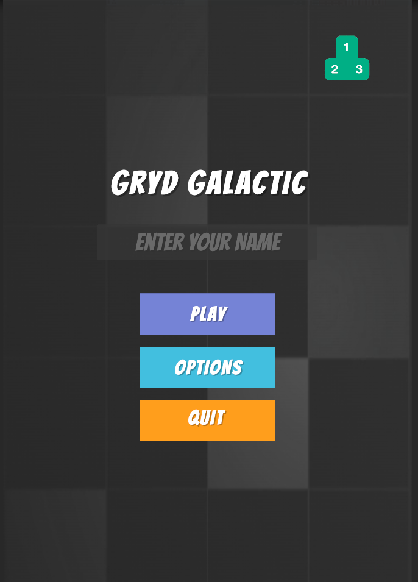
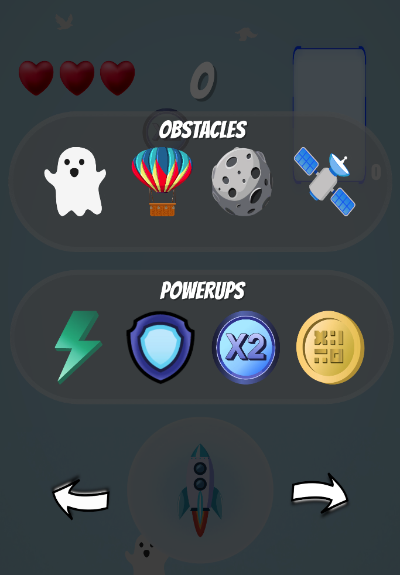
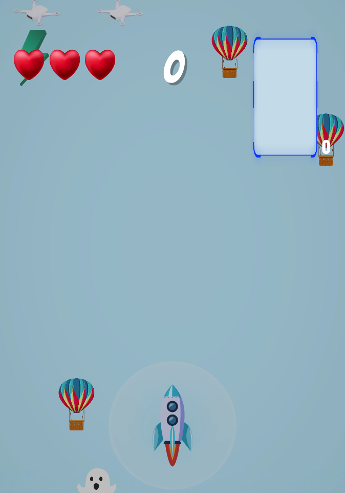
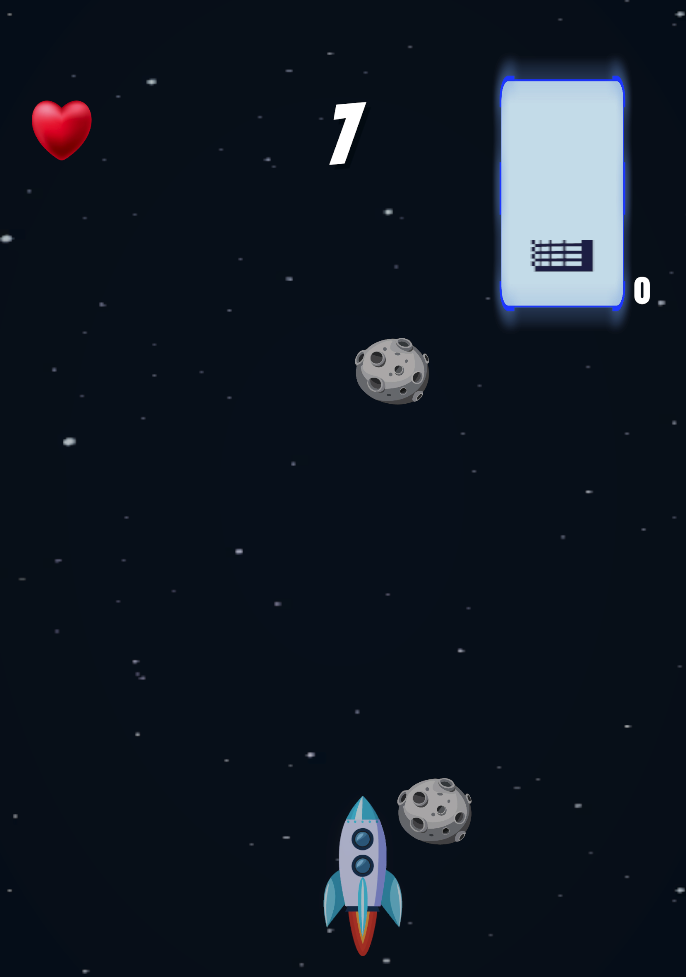
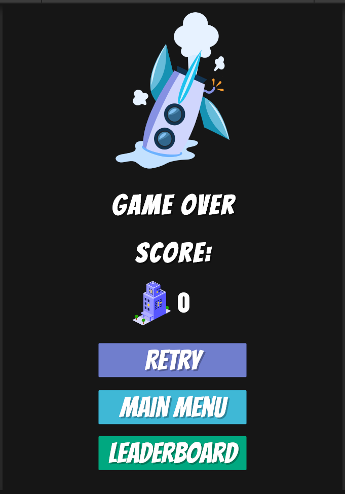
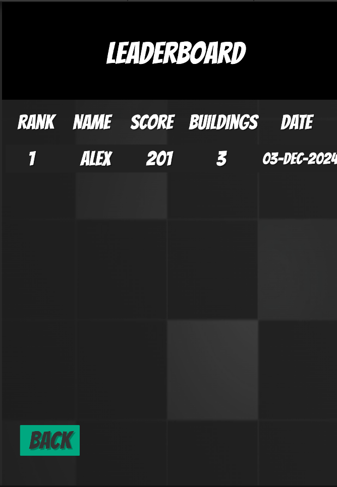

# Gryd Galactic

## Overview
**Gryd Galactic** is an exciting 2D space adventure set in the year 3082. Earth is overpopulated, and humanity is looking to the Moon for new opportunities. As a pilot, your mission is to guide a rocket through various challenges to help humanity rebuild Earth while establishing colonies on the Moon. Navigate obstacles, collect power-ups, and contribute to cityscape development in this skill-based, action-packed game.

## Features
- **Dynamic Rocket Controls:** Use a joystick to steer your rocket through Earth's atmosphere and into space.
- **Diverse Obstacles:** Avoid air balloons, ghosts, asteroids, satellites, and UFOs.
- **Power-Ups:** Collect shields, speed boosts, and most importantly Gryd Coins to enhance gameplay and aid Earth’s recovery.
- **Leaderboard Integration:** Compete with players worldwide and track your progress on all-time and daily leaderboards. --Coming soon, currently only on device leaderboard--

## Screenshots
Here are some screenshots showcasing the gameplay and features of **Gryd Galactic**:

### Main Menu

### Gameplay
  

### Game Over

### Leaderboard

## Tech Stack
- **Unity Hub:** Used to download and manage different versions of the Unity Editor (requires a Unity account).
- **Unity Editor:** 6000.0.25f1
- **Programming Language:** C#
- **XCode:** To deploy build to device